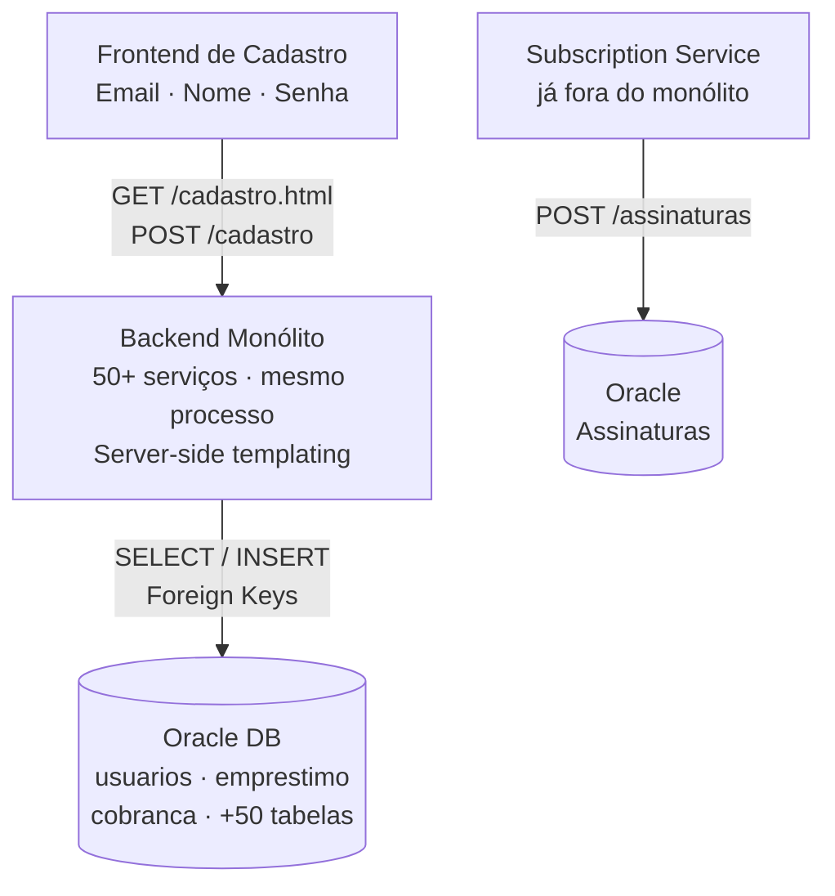
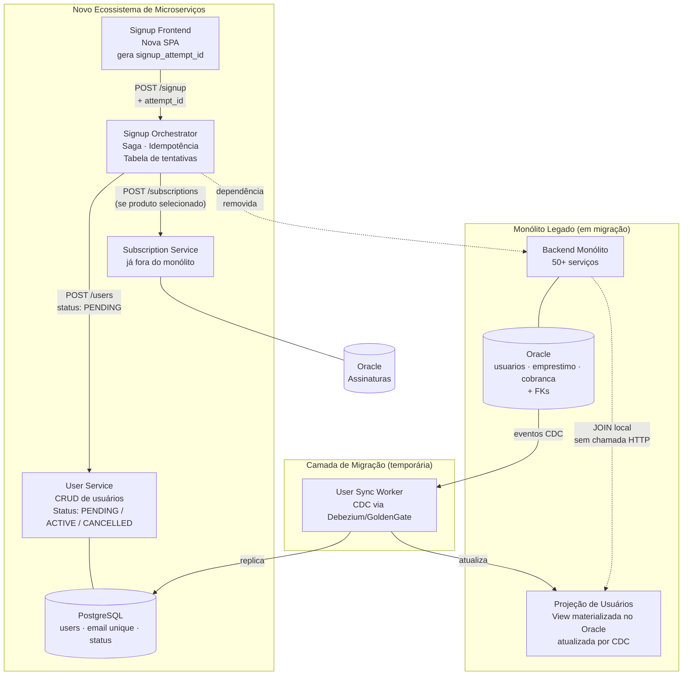
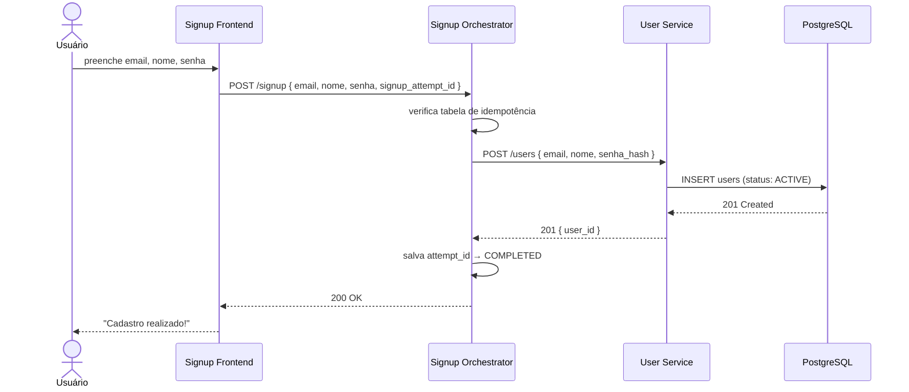
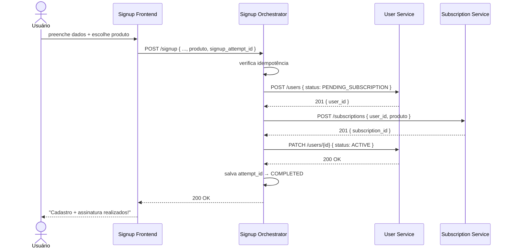
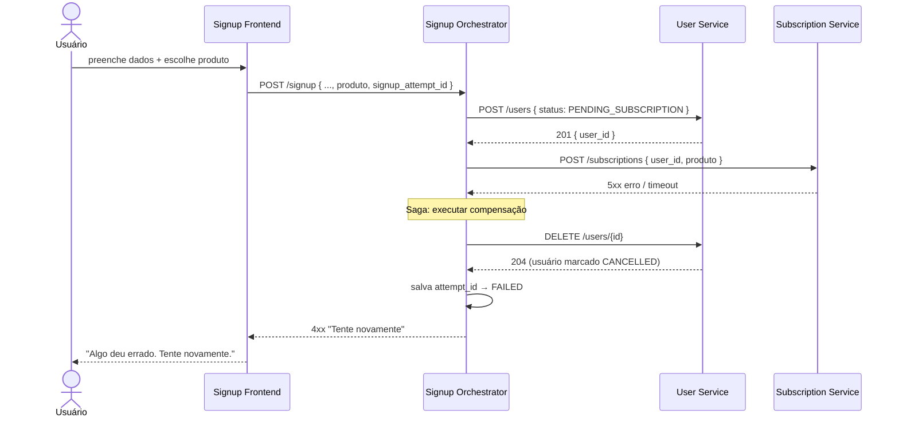
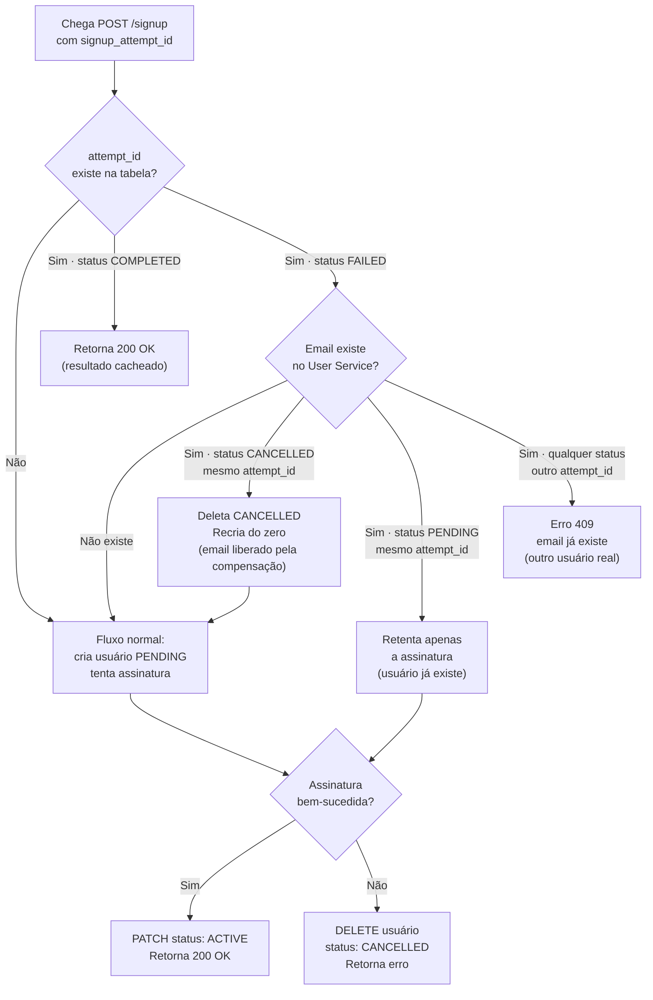
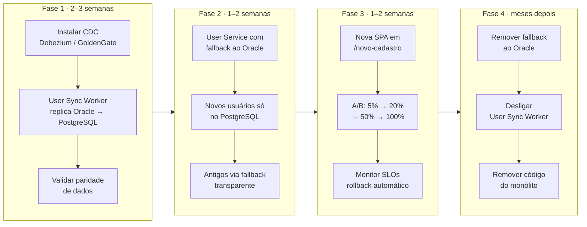
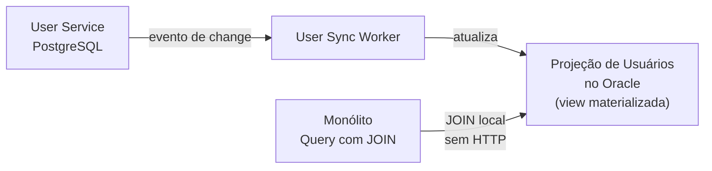
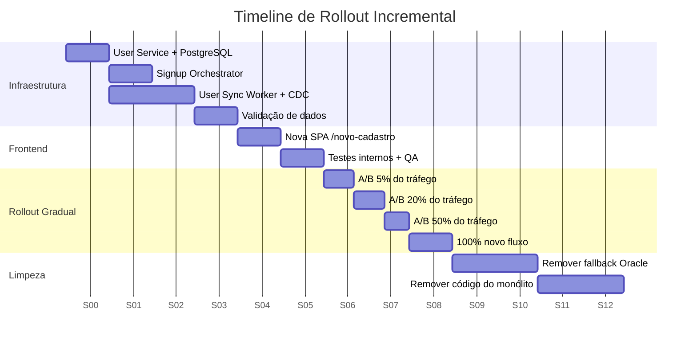

# Arquitetura de Extração do Cadastro — Monólito → Microserviços

> Planejamento completo para remover o cadastro do monólito, garantindo independência do banco Oracle, consistência entre cadastro e assinatura, e rollout incremental sem downtime.

---

## Sumário

1. [Contexto e Problema](#1-contexto-e-problema)
2. [Arquitetura Proposta](#2-arquitetura-proposta)
3. [Serviços e Responsabilidades](#3-serviços-e-responsabilidades)
4. [Fluxo de Cadastro](#4-fluxo-de-cadastro)
   - [Sem assinatura](#41-sem-assinatura)
   - [Com assinatura — Saga Pattern](#42-com-assinatura--saga-pattern)
5. [O Maior Desafio: Idempotência no Retry](#5-o-maior-desafio-idempotência-no-retry)
6. [Migração de Dados](#6-migração-de-dados)
7. [Impacto no Monólito](#7-impacto-no-monólito)
8. [Estratégia de Rollout](#8-estratégia-de-rollout)
9. [Trade-offs](#9-trade-offs)

---

## 1. Contexto e Problema

### Estado atual do monólito



**Problemas:**
- Muitos times editando a mesma base de código → conflitos e lentidão
- Contenção de recursos: pool de threads, memória, CPU e conexões são compartilhados entre os +50 serviços
- Um serviço lento derruba os demais → indisponibilidades em cascata
- O cadastro depende sincronamente do Oracle do monólito

---

## 2. Arquitetura Proposta

### Visão geral após a migração



---

## 3. Serviços e Responsabilidades

| Serviço | Responsabilidade | Tecnologia sugerida | Banco |
|---|---|---|---|
| **Signup Frontend** | Nova SPA de cadastro. Gera `signup_attempt_id` (UUID) ao carregar o form. | React / HTML simples | — |
| **Signup Orchestrator** | Ponto de entrada único. Orquestra User Service + Subscription Service. Implementa a Saga e a tabela de idempotência. | REST API | PostgreSQL (tabela `signup_attempts`) |
| **User Service** | CRUD de usuários. Valida unicidade de email. Gerencia o ciclo de status do usuário. | REST API | PostgreSQL próprio |
| **User Sync Worker** | Consome eventos CDC do Oracle do monólito e replica para o PostgreSQL do User Service. Mantém a projeção de usuários no Oracle. | Worker assíncrono | Lê Oracle, escreve PostgreSQL |
| **Subscription Service** | Já existe fora do monólito. Cria assinaturas vinculadas a um `user_id`. | REST API (existente) | Oracle próprio |

---

## 4. Fluxo de Cadastro

### 4.1 Sem assinatura



### 4.2 Com assinatura — Saga Pattern

#### Caminho feliz



#### Caminho de compensação (falha na assinatura)



> **Nota:** O usuário recebe um erro claro e pode tentar novamente com o mesmo endereço de email, sem receber a mensagem: "E-mail já cadastrado".

---

## 5. O Maior Desafio: Idempotência no Retry

Este é o ponto mais crítico do exercício. A solução combina dois mecanismos.

### Mecanismo 1 — `signup_attempt_id`

O frontend gera um UUID ao **carregar o formulário**. Esse UUID é enviado em todo request. O Orchestrator mantém uma tabela:

```sql
CREATE TYPE signup_attempt_status AS ENUM (
    'PROCESSING',
    'COMPLETED',
    'FAILED'
);
```

```sql
CREATE TABLE signup_attempts (
    attempt_id    UUID PRIMARY KEY,
    email         VARCHAR NOT NULL,
    status        signup_attempt_status NOT NULL,
    user_id       UUID,
    created_at    TIMESTAMP DEFAULT NOW(),
    updated_at    TIMESTAMP DEFAULT NOW()
);
```

### Mecanismo 2 — Status `PENDING_SUBSCRIPTION`

O usuário é criado com status `PENDING_SUBSCRIPTION` antes da assinatura ser tentada. Isso permite que o Orchestrator distinga retentativas legítimas de conflitos reais.

### Tabela de decisão para retries



### Resumo dos cenários

| Cenário | Status no DB | `attempt_id` | Comportamento |
|---|---|---|---|
| Primeiro envio | não existe | novo | Cria `PENDING`, tenta assinatura |
| Retry — PENDING ainda ativo | `PENDING_SUBSCRIPTION` | mesmo | Retenta apenas a assinatura |
| Retry — outro usuário, mesmo email | `PENDING` ou `ACTIVE` | diferente | Erro 409 — email já existe |
| Retry após compensação | `CANCELLED` | mesmo | Deleta `CANCELLED`, recria do zero |
| Cadastro simples, retry | `COMPLETED` | mesmo | Retorna resultado cacheado |

---

## 6. Migração de Dados

### Fases da migração



### Estratégia de Foreign Keys e JOINs

O ponto mais sensível é não degradar a performance do monólito durante a migração.

**Foreign Keys:** As FKs existentes no Oracle (tabelas `emprestimo`, `cobranca`, etc. apontando para `usuarios.id_usuario`) são **mantidas intactas** durante toda a migração. Novos usuários criados no PostgreSQL recebem um UUID sem relação de FK relacional com o Oracle — o monólito trata o `user_id` como campo opaco.

**Queries com JOIN:** O monólito não deve fazer chamadas HTTP ao User Service a cada query — isso aumentaria latência e criaria dependência. A solução é uma **projeção local**:



O monólito continua fazendo `JOIN` diretamente no Oracle, sem nenhuma mudança no código. O Sync Worker mantém a projeção atualizada com os dados do User Service. O lag do CDC é aceitável para telas não-críticas como a listagem de empréstimos.

---

## 7. Impacto no Monólito

| Área | Mudança necessária | Risco | Mitigação |
|---|---|---|---|
| Endpoint `/cadastro` | Vira stub que redireciona para o novo serviço | Baixo | Manter por tempo indeterminado durante transição |
| Tabela `usuarios` Oracle | Nenhuma mudança imediata | Baixo | Sync Worker mantém a tabela em sincronia |
| FKs para `usuarios` | Nenhuma mudança imediata | Baixo | Mantidas durante toda a migração |
| Queries com JOIN | Nenhuma mudança | Baixo | Projeção local garante JOIN funcionando |
| Pool de recursos | Cadastro sai do processo | **Positivo** | Menos contenção nos 50+ serviços restantes |

> **Regra de ouro:** nenhuma mudança no monólito deve aumentar latência ou criar nova dependência de rede em queries existentes.

---

## 8. Estratégia de Rollout



### Critérios de avanço entre fases

- **Latência p99** do cadastro < 800ms
- **Taxa de erro** < 0.1%
- **Paridade de dados** entre Oracle e PostgreSQL validada por amostragem
- **Rollback automático** disponível via feature flag a qualquer momento

---

## 9. Trade-offs

### Saga orquestrada vs. coreografada

| | Orquestrada (escolha) | Coreografada (alternativa) |
|---|---|---|
| **Rastreabilidade** | ✅ Orchestrator conhece o estado completo | ❌ Estado distribuído entre serviços |
| **Compensação** | ✅ Lógica centralizada e explícita | ⚠️ Cada serviço precisa lidar com rollback |
| **Acoplamento** | ⚠️ Orchestrator conhece os dois serviços | ✅ Serviços independentes |
| **Adequação** | ✅ Ideal para fluxo curto com 2 serviços | Mais adequado para fluxos com muitos serviços |

### Status `PENDING_SUBSCRIPTION`

- ✅ Resolve o problema de retry sem precisar de transação distribuída (2PC)
- ✅ Permite distinguir retentativas legítimas de conflitos reais de email
- ⚠️ Exige job de limpeza periódica de registros `PENDING` com mais de X horas (usuários "zumbis")

### Projeção de usuários no Oracle

- ✅ Zero latência extra nas telas do monólito — JOIN continua sendo local
- ✅ Nenhuma mudança de código no monólito
- ⚠️ Lag do CDC: dados podem estar levemente desatualizados (aceitável para telas como listagem de empréstimos)
- ⚠️ Para telas que precisam de dados em tempo real, o monólito pode chamar o User Service pontualmente

### Assinatura síncrona (decisão do PO)

- ✅ UX imediata: usuário sabe na hora se a assinatura foi criada
- ⚠️ Latência do cadastro com assinatura depende do Subscription Service
- 🛡️ Mitigação: timeout agressivo (ex: 5s) + mensagem clara pedindo nova tentativa

### Fallback ao Oracle durante migração

- ✅ Zero downtime — usuários existentes nunca somem
- ✅ Permite validar dados em produção antes do cutover
- ⚠️ Complexidade temporária no User Service (remover na Fase 4)

---

## Glossário

| Termo | Definição |
|---|---|
| **Saga** | Padrão para transações distribuídas: cada etapa tem uma ação de compensação em caso de falha |
| **CDC** | Change Data Capture — captura eventos de insert/update/delete diretamente do log do banco |
| **Idempotência** | Propriedade de uma operação que pode ser executada múltiplas vezes com o mesmo resultado |
| **`signup_attempt_id`** | UUID gerado pelo frontend ao carregar o formulário, usado para identificar retentativas |
| **Strangler Fig** | Padrão de migração incremental: novo sistema cresce ao redor do antigo até substituí-lo completamente |
| **Projeção** | Cópia desnormalizada de dados mantida em sincronia para otimizar leituras locais |
