# Saga Pattern — Cadastro de Usuários com Assinatura

> Planejamento arquitetural completo aplicando o padrão **Saga Orquestrada** para garantir consistência distribuída entre o cadastro de usuário e a criação de assinatura, sem depender de transação distribuída (2PC) e sem deixar estados inconsistentes visíveis ao usuário.

---

## Sumário

1. [Por que Saga?](#1-por-que-saga)
2. [Escolha: Saga Orquestrada](#2-escolha-saga-orquestrada)
3. [Definição da Saga](#3-definição-da-saga)
4. [Estados e Transições do Usuário](#4-estados-e-transições-do-usuário)
5. [Fluxo Completo — Caminho Feliz](#5-fluxo-completo--caminho-feliz)
6. [Fluxos de Compensação](#6-fluxos-de-compensação)
7. [O Problema do Retry — Idempotência](#7-o-problema-do-retry--idempotência)
8. [Arquitetura dos Serviços](#8-arquitetura-dos-serviços)
9. [Modelo de Dados](#9-modelo-de-dados)
10. [Migração do Monólito](#10-migração-do-monólito)
11. [Rollout Incremental](#11-rollout-incremental)
12. [Trade-offs](#12-trade-offs)

---

## 1. Por que Saga?

O problema exige coordenar **duas operações em serviços distintos** — criar usuário e criar assinatura — como se fossem uma única transação lógica:

- Se o usuário for criado mas a assinatura falhar → o usuário não pode ficar "preso" em estado inconsistente
- Se o usuário tentar novamente com o mesmo email → não pode receber erro de "E-mail já cadastrado"
- A confirmação deve ser **síncrona** (requisito do PO) — não é possível usar filas assíncronas

Uma transação distribuída clássica (2PC — Two-Phase Commit) resolveria a atomicidade, mas introduz acoplamento forte entre serviços, bloqueios de longa duração e é inviável quando os serviços têm bancos de dados diferentes.

O padrão **Saga** resolve isso decompondo a operação em etapas locais, cada uma com uma **transação de compensação** correspondente que desfaz o efeito caso algo falhe.

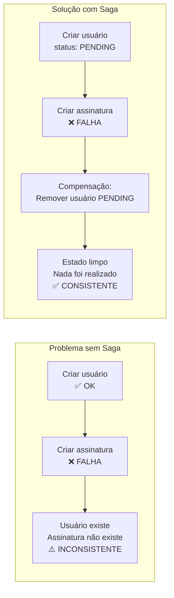

---

## 2. Escolha: Saga Orquestrada

Existem duas variações do padrão:

| | **Orquestrada** ✅ (escolha) | **Coreografada** |
|---|---|---|
| **Coordenação** | Um orquestrador central comanda cada etapa | Serviços emitem e reagem a eventos |
| **Estado da Saga** | Centralizado no orquestrador | Distribuído entre os serviços |
| **Compensação** | Orquestrador chama as compensações explicitamente | Cada serviço reage a eventos de falha |
| **Rastreabilidade** | ✅ Fácil — estado em um único lugar | Difícil — requer correlação de eventos |
| **Número de serviços** | Ideal para poucos serviços (2–4) | Ideal para muitos serviços |
| **Adequação ao problema** | ✅ Excelente — 2 serviços, fluxo síncrono | Introduz complexidade desnecessária |

**Motivo da escolha:** o fluxo envolve apenas dois serviços (User Service + Subscription Service), a confirmação precisa ser síncrona, e a rastreabilidade do estado é crítica para implementar a idempotência no retry.

---

## 3. Definição da Saga

A Saga é composta por **duas transações locais**, cada uma com sua compensação:

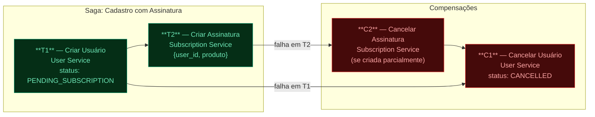

### Tabela de transações e compensações

| Etapa | Serviço | Transação | Compensação |
|---|---|---|---|
| **T1** | User Service | `POST /users` → cria usuário com `status: PENDING_SUBSCRIPTION` | `PATCH /users/{id}` → `status: CANCELLED` |
| **T2** | Subscription Service | `POST /subscriptions` → cria assinatura vinculada ao `user_id` | `DELETE /subscriptions/{id}` → cancela assinatura |
| **Finalização** | User Service | `PATCH /users/{id}` → `status: ACTIVE` | — (ponto de não retorno) |

> **Ponto de não retorno:** após o `PATCH status: ACTIVE`, a operação é considerada commitada. Se algo falhar depois desse ponto, o usuário já está ativo e com assinatura — não há inconsistência.

---

## 4. Estados e Transições do Usuário

O status do usuário no User Service é o coração da solução. Ele reflete o estado da Saga em andamento.

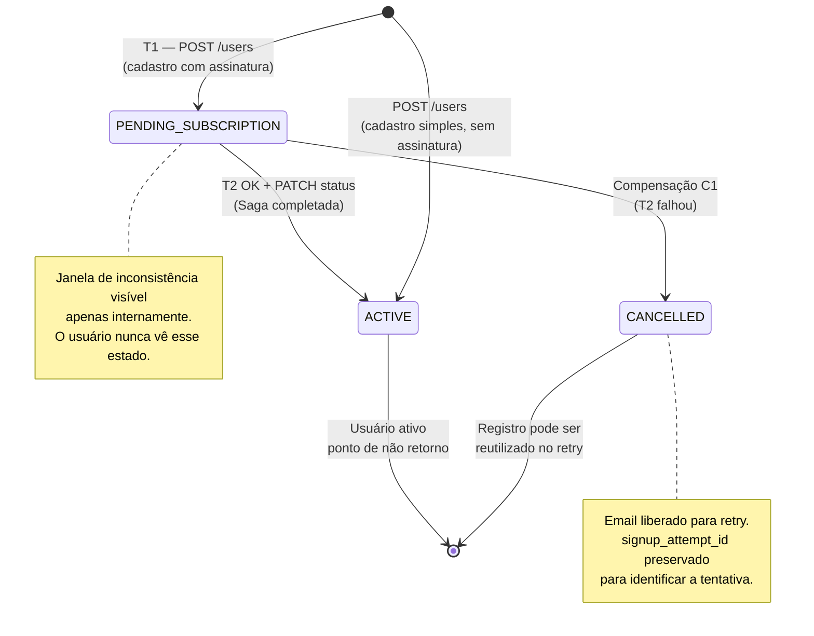

---

## 5. Fluxo Completo — Caminho Feliz

### Cadastro simples (sem assinatura)

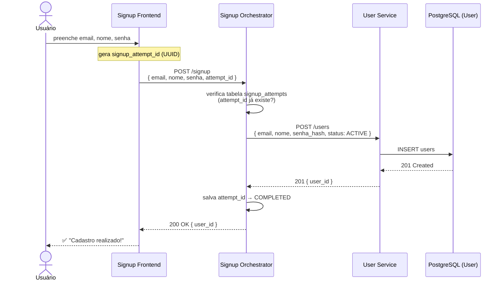

### Cadastro com assinatura — Saga completa

```mermaid
sequenceDiagram
    actor U as Usuário
    participant FE as Signup Frontend
    participant OR as Signup Orchestrator
    participant US as User Service
    participant SS as Subscription Service

    U->>FE: preenche dados + escolhe produto
    note over FE: gera signup_attempt_id (UUID)
    FE->>OR: POST /signup<br/>{ email, nome, senha, produto, attempt_id }

    OR->>OR: 1. verifica idempotência
    note over OR: attempt_id não existe → prosseguir

    rect rgb(5, 46, 22)
        note over OR,US: T1 — Transação Local: Criar Usuário
        OR->>US: POST /users<br/>{ email, nome, senha_hash,<br/>status: PENDING_SUBSCRIPTION }
        US-->>OR: 201 { user_id }
        OR->>OR: salva attempt_id → PROCESSING<br/>salva user_id para compensação
    end

    rect rgb(5, 46, 22)
        note over OR,SS: T2 — Transação Local: Criar Assinatura
        OR->>SS: POST /subscriptions<br/>{ user_id, produto }
        SS-->>OR: 201 { subscription_id }
    end

    rect rgb(5, 46, 22)
        note over OR,US: Finalização — Ativar Usuário
        OR->>US: PATCH /users/{user_id}<br/>{ status: ACTIVE }
        US-->>OR: 200 OK
    end

    OR->>OR: salva attempt_id → COMPLETED
    OR-->>FE: 200 OK { user_id, subscription_id }
    FE-->>U: ✅ "Cadastro + assinatura realizados!"
```

---

## 6. Fluxos de Compensação

### Cenário A — Falha em T1 (User Service indisponível)

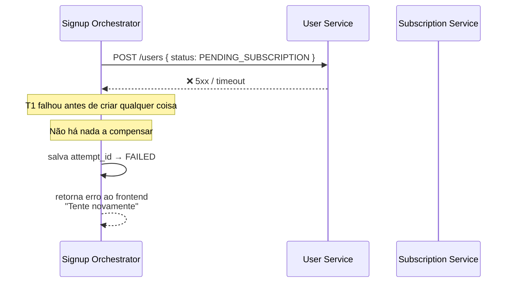

> Nenhuma compensação necessária. O usuário não foi criado. O retry com o mesmo `attempt_id` tentará novamente do zero.

---

### Cenário B — Falha em T2 (Subscription Service indisponível)

```mermaid
sequenceDiagram
    participant OR as Signup Orchestrator
    participant US as User Service
    participant SS as Subscription Service

    OR->>US: POST /users { status: PENDING_SUBSCRIPTION }
    US-->>OR: 201 { user_id }
    OR->>OR: salva user_id para rollback

    OR->>SS: POST /subscriptions { user_id, produto }
    SS-->>OR: ❌ 5xx / timeout

    note over OR: T2 falhou — executar compensação C1

    rect rgb(69, 10, 10)
        note over OR,US: C1 — Compensação: Cancelar Usuário
        OR->>US: PATCH /users/{user_id}<br/>{ status: CANCELLED }
        US-->>OR: 200 OK
    end

    OR->>OR: salva attempt_id → FAILED
    OR-->>OR: retorna erro ao frontend<br/>"Tente novamente"
```

---

### Cenário C — Falha no PATCH de ativação (após assinatura criada)

```mermaid
sequenceDiagram
    participant OR as Signup Orchestrator
    participant US as User Service
    participant SS as Subscription Service

    OR->>US: POST /users { status: PENDING_SUBSCRIPTION }
    US-->>OR: 201 { user_id }

    OR->>SS: POST /subscriptions { user_id, produto }
    SS-->>OR: 201 { subscription_id }
    OR->>OR: salva subscription_id para rollback

    OR->>US: PATCH /users/{user_id} { status: ACTIVE }
    US-->>OR: ❌ 5xx / timeout

    note over OR: Assinatura criada mas usuário não ativado
    note over OR: Executar compensação C2 + C1

    rect rgb(69, 10, 10)
        note over OR,SS: C2 — Compensação: Cancelar Assinatura
        OR->>SS: DELETE /subscriptions/{subscription_id}
        SS-->>OR: 204 OK
    end

    rect rgb(69, 10, 10)
        note over OR,US: C1 — Compensação: Cancelar Usuário
        OR->>US: PATCH /users/{user_id} { status: CANCELLED }
        US-->>OR: 200 OK
    end

    OR->>OR: salva attempt_id → FAILED
    OR-->>OR: retorna erro ao frontend
```

---

### Visão geral dos cenários de falha

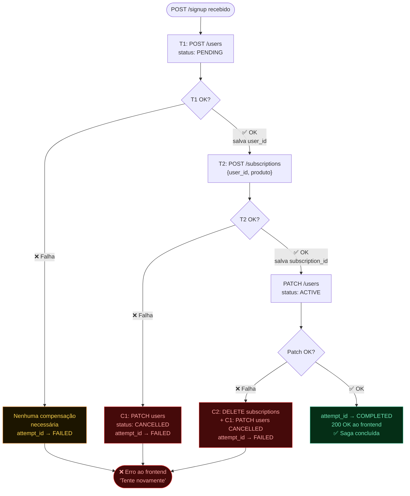

---

## 7. O Problema do Retry — Idempotência

Este é o maior desafio: após uma falha, o usuário tenta novamente com o **mesmo email**. A compensação pode ter deixado um registro `CANCELLED` no banco. A solução usa **dois mecanismos combinados**.

### Mecanismo 1 — `signup_attempt_id`

O frontend gera um UUID ao **carregar o formulário** (não ao submeter). Esse UUID identifica a tentativa de cadastro e é enviado em todo request, inclusive nos retries.

### Mecanismo 2 — Tabela `signup_attempts` no Orchestrator

```sql
CREATE TYPE signup_attempt_status AS ENUM (
    'PROCESSING',
    'COMPLETED',
    'FAILED'
);
```

```sql
CREATE TABLE signup_attempts (
    attempt_id       UUID PRIMARY KEY,
    email            VARCHAR      NOT NULL,
    status           signup_attempt_status NOT NULL,
    user_id          UUID,                   -- preenchido após T1
    subscription_id  UUID,                   -- preenchido após T2
    created_at       TIMESTAMP    DEFAULT NOW(),
    updated_at       TIMESTAMP    DEFAULT NOW()
);
```

### Árvore de decisão para retries

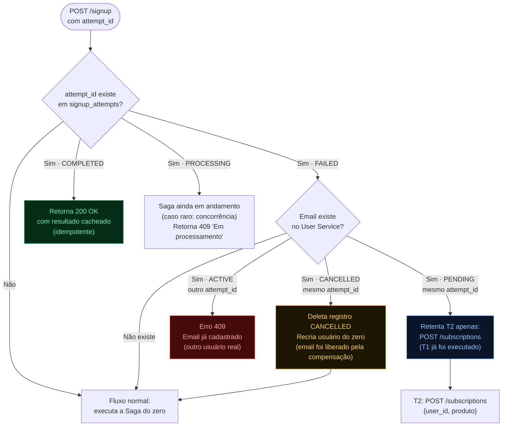

### Tabela de todos os cenários de retry

| Estado no DB | `attempt_id` | Email | Comportamento do Orchestrator |
|---|---|---|---|
| Não existe | Novo | Livre | Executa Saga do zero |
| `COMPLETED` | Mesmo | — | Retorna 200 OK cacheado |
| `FAILED` + usuário não existe | Mesmo | Livre | Executa Saga do zero |
| `FAILED` + usuário `CANCELLED` | Mesmo | Existente | Deleta `CANCELLED`, executa Saga do zero |
| `FAILED` + usuário `PENDING` | Mesmo | Existente | Retenta apenas T2 (assinatura) |
| `FAILED` + usuário `ACTIVE` | Diferente | Existente | Erro 409 — E-mail já cadastrado |
| `PROCESSING` | Mesmo | — | 409 "Em processamento" (evita dupla execução) |

---

## 8. Arquitetura dos Serviços

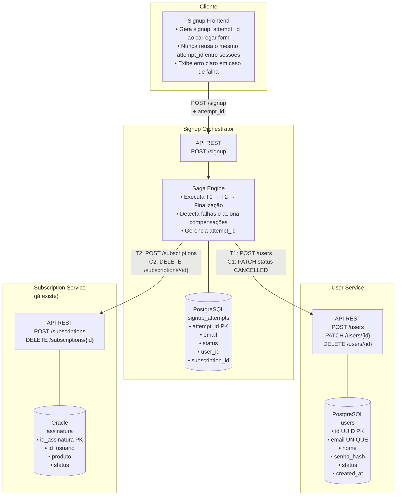

### Contrato de API do Signup Orchestrator

```
POST /signup

Request:
{
  "email":           "usuario@email.com",
  "nome":            "João Silva",
  "senha":           "senha123",
  "attempt_id":      "550e8400-e29b-41d4-a716-446655440000",  // UUID gerado pelo frontend
  "produto":         "PLANO_BASICO"  // opcional — se presente, cria assinatura
}

Response 200 — sucesso:
{
  "user_id":         "7f3b2e1a-...",
  "subscription_id": "9c4d5f2b-..."  // presente apenas se produto foi selecionado
}

Response 409 — E-mail já cadastrado:
{
  "error": "EMAIL_ALREADY_EXISTS",
  "message": "Este e-mail já está em uso."
}

Response 4xx — falha na Saga (retry possível):
{
  "error": "SAGA_FAILED",
  "message": "Ocorreu um erro. Por favor, tente novamente.",
  "retryable": true
}
```

---

## 9. Modelo de Dados

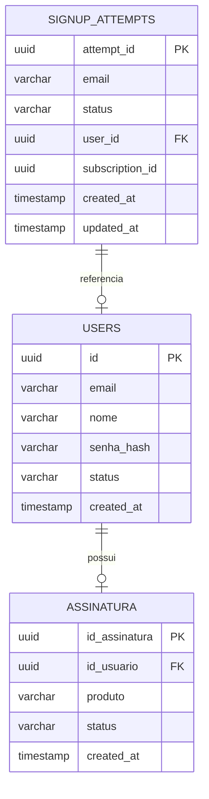

**Status do usuário:**
- `PENDING_SUBSCRIPTION` — T1 executado, aguardando T2
- `ACTIVE` — Saga concluída (ou cadastro simples)
- `CANCELLED` — Compensação executada após falha em T2

**Status da tentativa (signup_attempts):**
- `PROCESSING` — Saga em andamento
- `COMPLETED` — Saga concluída com sucesso
- `FAILED` — Saga falhou, compensações executadas

---

## 10. Migração do Monólito

A estratégia usa o padrão **Strangler Fig**: o novo sistema cresce ao redor do monólito até substituí-lo completamente, sem downtime.

### Problema com Foreign Keys e JOINs

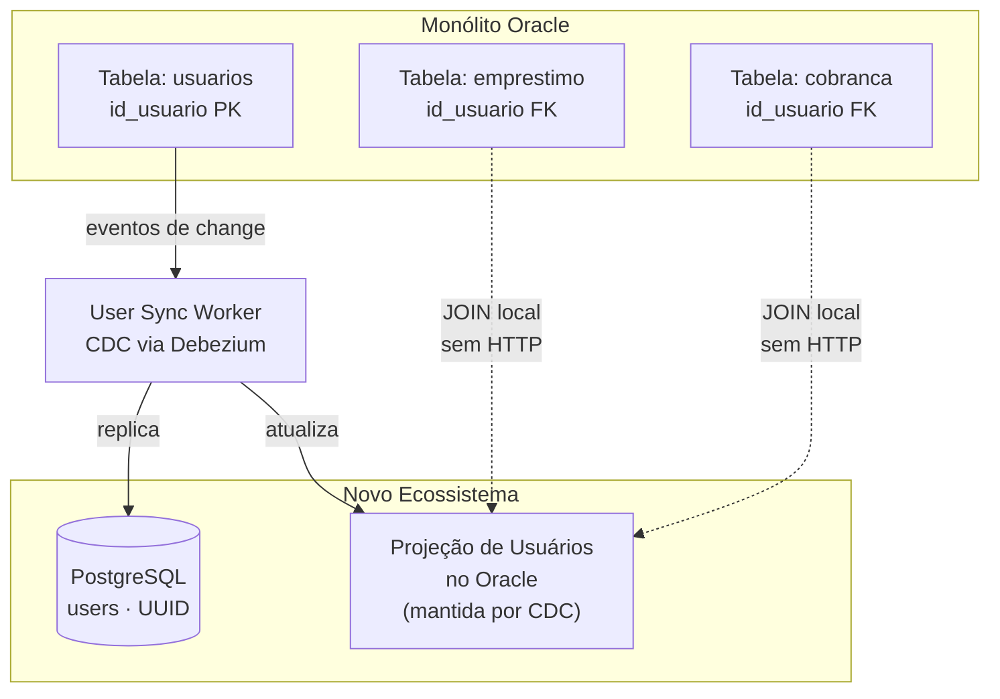

**Estratégia para JOINs:** o monólito continua fazendo JOINs diretamente no Oracle, usando uma **projeção local** (view materializada ou tabela espelho) mantida em sincronia pelo User Sync Worker via CDC. Zero mudança no código do monólito, zero latência extra.

### Fases da migração

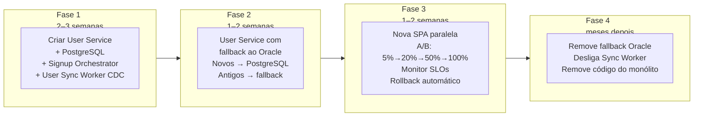

---

## 11. Rollout Incremental

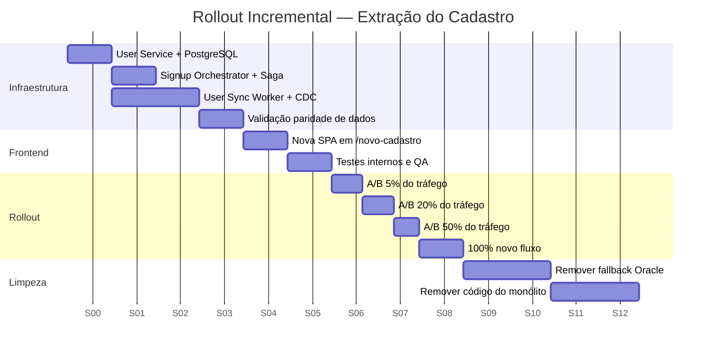

**Critérios de avanço:**
- Latência p99 do cadastro < 800ms
- Taxa de erro < 0.1%
- Paridade de dados Oracle ↔ PostgreSQL validada por amostragem diária
- Feature flag de rollback disponível a qualquer momento

---

## 12. Trade-offs

### Saga Orquestrada

| Aspecto | Decisão | Justificativa |
|---|---|---|
| **Consistência** | Eventual, com compensação | 2PC é inviável entre serviços com bancos distintos |
| **Visibilidade do estado** | `PENDING` visível internamente | Nunca exposto ao usuário final |
| **Janela de inconsistência** | Milissegundos a segundos | Aceitável — o usuário aguarda a resposta síncrona |
| **Acoplamento** | Orchestrator conhece os dois serviços | Trade-off intencional pela rastreabilidade |
| **Falha na compensação** | Job de retry para compensações pendentes | Compensação C1/C2 também pode falhar e precisa de retry |

### Status `PENDING_SUBSCRIPTION`

- ✅ Resolve o retry sem 2PC
- ✅ Permite distinguir retentativas legítimas de conflitos reais
- ⚠️ Requer **job de limpeza** de registros `PENDING` com mais de X horas (usuários "zumbis" de Sagas que nunca concluíram)

### Confirmação síncrona (requisito do PO)

- ✅ UX imediata — o usuário sabe na hora o resultado
- ⚠️ Latência do cadastro com assinatura depende do Subscription Service
- 🛡️ Mitigação: timeout configurado (ex: 5 segundos) com mensagem clara pedindo nova tentativa

### Projeção de usuários no Oracle

- ✅ Zero mudança no monólito — JOINs continuam funcionando localmente
- ✅ Zero aumento de latência nas telas existentes
- ⚠️ Lag de CDC: dados podem estar levemente desatualizados (segundos)
- ✅ Aceitável para telas não-críticas como listagem de empréstimos

---

## Glossário

| Termo | Definição |
|---|---|
| **Saga** | Padrão para transações distribuídas: sequência de transações locais, cada uma com uma compensação que desfaz seu efeito em caso de falha |
| **Transação local** | Operação atômica dentro de um único serviço/banco — não envolve coordenação entre serviços |
| **Compensação** | Operação que desfaz semanticamente o efeito de uma transação anterior. Não é um rollback técnico — é uma nova transação com lógica inversa |
| **Saga Orquestrada** | Variação do padrão onde um componente central (Orchestrator) comanda cada etapa e suas compensações |
| **Idempotência** | Propriedade de uma operação que produz o mesmo resultado independentemente de quantas vezes for executada com os mesmos parâmetros |
| **`signup_attempt_id`** | UUID gerado pelo frontend ao carregar o formulário, usado para identificar uma tentativa de cadastro e permitir retries seguros |
| **CDC** | Change Data Capture — captura eventos de mudança diretamente do log do banco de dados, sem polling |
| **Strangler Fig** | Padrão de migração incremental onde o novo sistema é construído ao redor do antigo até substituí-lo completamente |
| **Ponto de não retorno** | Momento da Saga após o qual a operação é considerada commitada e não há mais compensação possível |
